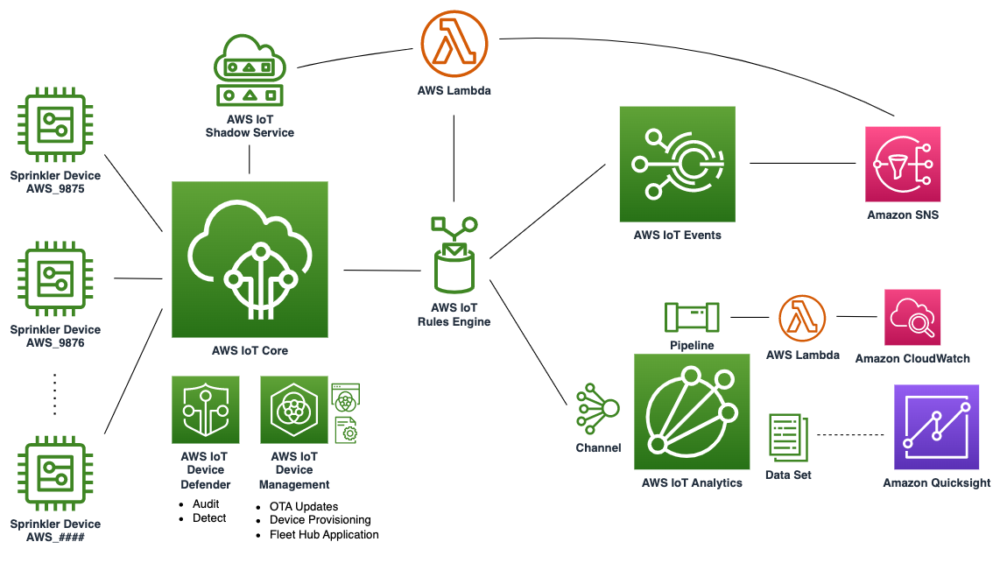
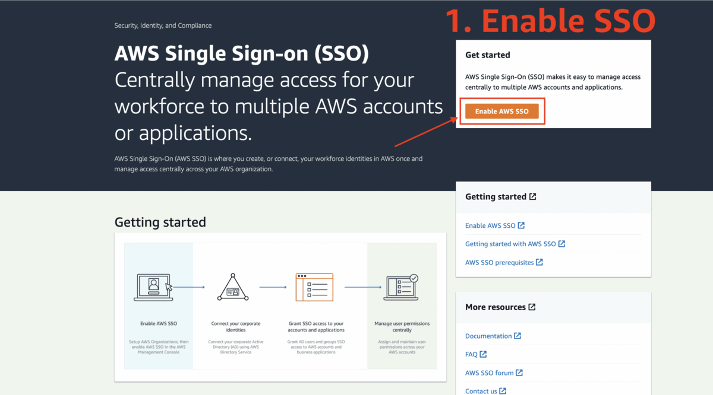
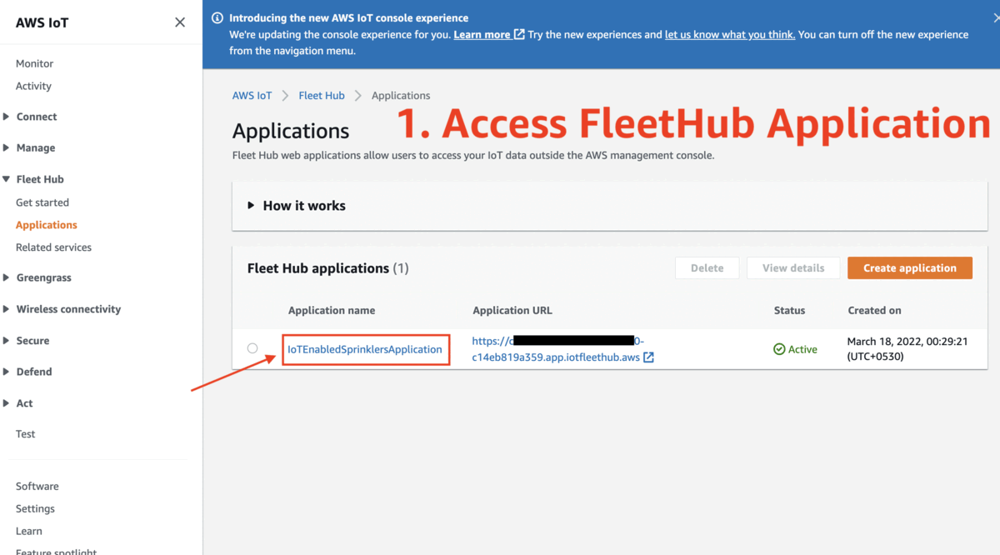

# Welcome to the IoT Enabled Sprinkler project!

Create a scalable fleet of IoT Enabled Sprinklers that turn off/on depending on whether the soil is hydrated/dry as well as report the amount of water utilized. Features include:

    * Automatic Device provisioning and certificate rotation using Fleet Provisioning + AWS IoT Jobs. 
    * Devices can be Monitored, Managed, and Analyzed via the FleetHub Application 
    * Device's sprinkler state can be monitored on the cloud in IoT Events
    * Real time water consumption of sprinklers can be monitored in CloudWatch metrics
    * Device's security is managed using Device Defender Audit and Detect; with ability to quarantine affected devices.
    * Device's sensor parameters can be altered in the cloud, without needing to change code on device
    * Setup is ready to be integrated with analytics/ml services like: Sagemaker, Quicksight, etc.
    * Project offers easy scale up and scale down capability

 

> :warning: **THIS PROJECT IS STRICTLY A "PROOF OF CONCEPT"**: If you want to deploy this solution in a production environment, please refer the [Considerations for Production Environment](considerations_for_production.md) document in the repo

## 0. Setup SSO in desired region (skip if SSO is enabled)

 

## 1. Deploy CDK Stack

Note: EDIT the REGION and ACCOUNT_ID in the cdk.json file!

```
mkdir iot_enabled_sprinkler && \
    mkdir iot_enabled_sprinkler/cdk_files && \
    cd iot_enabled_sprinkler/cdk_files 
        
git clone https://github.com/aws-samples/aws-iot-enabled-sprinkler.git && \
    cd aws-iot-enabled-sprinkler && \
    python3 -m venv .venv && \
    source .venv/bin/activate && \
    pip install -r requirements.txt

chmod +x certificates-setup.sh && \
    bash certificates-setup.sh

chmod +x lambda-layer-setup.sh && \
    bash lambda-layer-setup.sh

cdk bootstrap aws://<your-account-id>/<your-region>

cat cdk.json
cdk deploy
```
Copy the values of Provisioning Tempalte Name and Provisioning Policy Name from stack outputs   

## 2. Setup Device Files

Download device files from S3 bucket.

Note: Replace the value of BUCKET_NAME with value received from stack outputs.

```
cd ../../ # Go back to the iot_enabled_sprinkler/ directory
BUCKET_NAME=iotenabledsprinklerstack-s3devicesbucketxxxx # Check stack outputs for bucket name
aws s3 sync s3://$BUCKET_NAME/devices ./devices
```

## 3 Running an unprovisioned device
Download required dependencies, set a device name, and run the device. It will automatically provision if it is running for the first time

Note:
    1. Please make sure the device_name starts with the prefix 'AWS_' as this will be checked in the 
provisioning template's pre-provisionig hook.
    2. You can alter device parameters during setup in the parameters.json file

```
DEVICE_NAME=AWS_9875

mkdir devices/$DEVICE_NAME && \
    cp -r devices/sample_device/* devices/$DEVICE_NAME/ && \
    sudo yum install jq -y && \
    python3 -m pip install awsiotsdk && \
    python3 -m pip install requests && \
    python3 -m pip install boto3 && \
    IOT_ENDPOINT=$(aws iot describe-endpoint --endpoint-type iot:Data-ATS | jq -r ".endpointAddress")

cat devices/$DEVICE_NAME/parameters.json # Alter values of required

python3 devices/$DEVICE_NAME/iot_sprinkler.py \
    --endpoint $IOT_ENDPOINT \
    --device_name $DEVICE_NAME 
```

## 3 b. Runing a provisioned Device

Once device is provisioned, you can run the device as usual.

```
python3 devices/$DEVICE_NAME/iot_sprinkler.py  \
    --endpoint $IOT_ENDPOINT \
    --device_name $DEVICE_NAME
```

## 4. Access FleetHub Application Dashboard

 


## Cleanup

### CDK Resources Cleanup
You can use `cdk destroy` to destroy all resources after navigating into the cdk directory: 

```
cd cdk_files/aws-iot-enabled-sprinkler
cdk destroy
deactivate
```
### Devices Cleanup from IoT Core

Remove device resources from IoT Core for each device.
Note: Set DEVICE_NAME variable to name of device.

```
DEVICE_NAME=AWS_9875

DEVICE_CERTIFICATE_ARN=$(aws iot list-thing-principals --thing-name $DEVICE_NAME | jq -r ".principals"[0]) && \
    aws iot detach-thing-principal --thing-name $DEVICE_NAME --principal $DEVICE_CERTIFICATE_ARN && \
    IFS='/'  && read -a arr <<<"$DEVICE_CERTIFICATE_ARN" && DEVICE_CERTIFICATE_ID=${arr[1]} && \
    aws iot update-certificate --certificate-id $DEVICE_CERTIFICATE_ID --new-status INACTIVE && \
    aws iot delete-certificate --certificate-id $DEVICE_CERTIFICATE_ID && \
    aws iot delete-thing --thing-name $DEVICE_NAME
```
If you see an aws cli error while deleting multiple devices, try using a new terminal window.

### Project resources manual cleanup

    1. Navigate to S3 Console. Empty, then Delete the S3 Bucket: "iotenabledsprinklerstack-s3devicesbucketxxxx" # Check stack outputs for bucket name
    2. Navigate to IoT Core Console -> All devices -> Thing types. Delete the thing type: "IotEnabledSprinkler"
    3. Navigate to IoT Core -> Security -> Certificate authorities. Deactivate, then Delete the RootCa created for the Project.

### Project files cleanup

Remove Project files from disk

```
cd ../../../ # Go back outside the iot_enabled_sprinkler/ directory
sudo rm -r iot_enabled_sprinkler/
```

## Troubleshooting Failed Stack Deployment/Deletion

If the stack fails during creation or destroying, please do the following:

    1. Navigate to AWS IoT Console -> Secure -> Certificates. Find the (Claim) Certificate that has the "FleetProvisioningClaimCertPolicy" attached to it, and detach the policy from it. Revoke and delete and the certificate as well
    2. Navigate to the S3 Console. Empty and delete the iotenabledsprinklerstack-s3devicesbucketxxxx bucket # Check stack outputs for bucket name
    3. Navigate to the Cloudformation console, and manually delete the stack.
    
## Security

See [CONTRIBUTING](CONTRIBUTING.md#security-issue-notifications) for more information.

## License

This library is licensed under the MIT-0 License. See the LICENSE file.